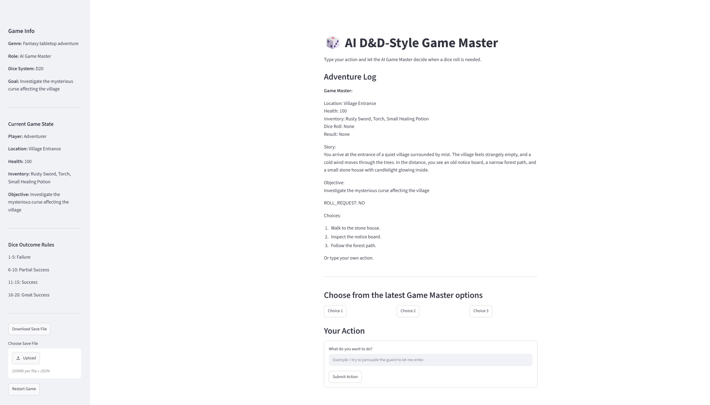

# SETUP
Language: Python
Frontend: Streamlit
AI API: Google Gemini
Environment: .env file

# AI Text Adventure Game Master (Something like DND)




## Design Decision

The project uses a D&D-style fantasy Game Master system because it gives the AI a clear role and purpose. Instead of acting as a general chatbot, the AI must narrate a fantasy adventure, respond to player actions, control NPCs, and keep the story within the selected world. The theme is restricted to a fantasy village, forest, ruins, and dungeon so that the AI is less likely to go off-topic or hallucinate unrelated scenarios.

When players want to take a break, they can just save the game (left side panel) to download the data JSON file (saved with data, time stamp). This allows them to keep track and continue from the session they were in.

## 1. Project Title and Description
AI Text Adventure Game Master is a text-based adventure game where an AI narrates the story and responds to the player's actions. It is designed for players who enjoy interactive story games.

## 2. Problem Statement
Traditional text adventure games usually have fixed responses and limited choices. This project uses AI to make the story more flexible, allowing players to type their own actions and receive dynamic responses.

## 3. Technology Stack
- Python
- Streamlit
- Google Gemini API
- python-dotenv
- GitHub

## 4. Project Structure

```text
AI_DND_Game_Master/
├── app.py
├── README.md
├── requirements.txt
├── LICENSE
├── .env
├── .gitignore
│
├── config/
│   ├── config.py
│   └── constants.py
│
├── services/
│   ├── ai_service.py
│   ├── game_controller.py
│   └── npc_memory.py
│
├── models/
│   └── game_state.py
│
├── parsers/
│   └── response_parser.py
│
├── prompts/
│   └── adventure_prompts.py
│
├── ui/
│   └── ui_components.py
│
├── utils/
│   ├── dice.py
│   └── session_manager.py
│
├── assets/
│   └── D&D_Game_Master_Bot_Link.png
│
└── docs/
    ├── prompts_to_show.txt
    └── test_inputs.txt
```

### Folder and File Purpose

| Folder / File | Purpose |
|---|---|
| `app.py` | Main Streamlit entry point that starts the application and controls the high-level app flow. |
| `README.md` | Project documentation, setup guide, limitations, and test cases. |
| `requirements.txt` | Lists the Python packages needed to run the project. |
| `LICENSE` | Contains the project license information. |
| `.gitignore` | Tells Git which files and folders should be ignored, such as `.env`, `.venv`, and cache files. |
| `config/config.py` | Stores adjustable settings such as the Gemini model name. |
| `config/constants.py` | Stores constant UI text and fixed values such as the app title and dice outcome rules. |
| `services/ai_service.py` | Handles communication with the Gemini API and stores the main AI system prompt rules. |
| `services/game_controller.py` | Controls the turn flow, including player actions, dice results, AI calls, and state updates. |
| `services/npc_memory.py` | Manages NPC creation, relationship values, attitudes, and memory formatting. |
| `models/game_state.py` | Creates, normalizes, saves, and loads the game state JSON data. |
| `parsers/response_parser.py` | Parses AI responses for health, inventory, location, dice requests, NPC updates, and win/loss states. |
| `prompts/adventure_prompts.py` | Builds the current turn prompt using player action, dice result, game state, and NPC memory. |
| `ui/ui_components.py` | Renders the header, sidebar, adventure log, save/load controls, dice UI, and player input form. |
| `utils/dice.py` | Handles D20 dice rolling and dice outcome categories. |
| `utils/session_manager.py` | Manages Streamlit session state, new game initialization, loaded games, and conversation history. |
| `docs/prompts_to_show.txt` | Contains demo prompts used during presentation or testing. |
| `docs/test_inputs.txt` | Contains sample user inputs for manual testing. |

This structure separates the project by responsibility:
- `models` = game data
- `services` = main logic
- `utils` = helper tools
- `ui` = Streamlit display
- `prompts` = AI prompt construction
- `parsers` = AI response extraction

## 5. Setup Instructions
1. Clone the repository.
2. Create Virtual environment in CMD using `python -m venv venv`.
3. Activate Virtual environment in CMD using `.venv\Scripts\activate`
4. Install dependencies in your virtual environment using `pip install -r requirements.txt`.
5. Copy `.env.example` and rename it to `.env`.
6. Add your Gemini API key into the `.env` file. (Gemini API key get it from Google AI studio)
7. Run the app using `streamlit run app.py`.

## 6. Usage Examples
Example 1:
User input: I walk into the forest.
AI output: The Game Master describes the forest and updates the player's location.

Example 2:
User input: I check my inventory.
AI output: The Game Master lists the player's current items and asks what the player wants to do next.

## 7. Known Limitations
- Limited character customization (players cannot create custom races, classes, or attributes).
- No structured RPG progression system such as levels, skills, or experience points.
- NPC memory currently uses a basic relationship-based system and does not support complex long-term memories.
- AI responses are non-deterministic and may occasionally generate inconsistent story details.
- The game relies on an external LLM API and is subject to internet connectivity and API quota limitations.
- Combat is narrative-driven and does not currently use a dedicated combat statistics system.
- The game currently supports only a single-player experience.
- As it gets longer, it might slowed down the web page as there are too many information showing.

## 8. Future Improvements
- Add character creation with races, classes, and starting attributes.
- Implement a structured RPG progression system with levels, skills, and experience points.
- Expand the NPC memory system with long-term relationships and faction reputation.
- Introduce a dedicated combat system with weapons, armor, and combat statistics.
- Add multiple story settings and campaign themes.
- Support multiplayer cooperative storytelling.
- Reduce AI inconsistencies through additional validation and world-state management.
- Add visual components (Image generation) such as maps, character panels, and inventory interfaces.
- Clean parts of UI that the player does not know, for example roll request, NPC created.

## 9. Streamlit cloud
https://aidndgamemaster.streamlit.app/

## 10. Test Cases

| Test Case | Input | Expected Output | Actual Output |
|---|---|---|---|
| TC01 - Start Adventure | I walk into the forest and look around. | AI continues the story, describes the forest, and asks for the next action. | Passed - AI described the forest and continued the adventure. |
| TC02 - Inventory Check | I check my inventory. | AI shows the player's current inventory. | Passed - AI listed the player's items. |
| TC03 - Use Item | I use the old map to find the tower. | AI uses the map as part of the story and gives a clue or direction. | Passed - AI gave a direction toward the tower. |
| TC04 - Combat Action | I attack the creature with my small knife. | AI handles combat and updates the story or health. | Passed - AI described the combat result and continued the story. |
| TC05 - Out-of-Scope Input | What is the capital of Japan? | AI should not answer like a normal chatbot and should guide the player back to the adventure. | Passed - AI redirected the player back to the game. |
| TC06 - Missing API Key | Remove or rename GEMINI_API_KEY in `.env`, then submit any input. | App shows a clear error message instead of crashing. | Passed - App displayed missing API key error. |

## About the author
**Vanessa Chua** — [LinkedIn] (www.linkedin.com/in/vanessa-chua-siew-jin) · [GitHub]
(https://github.com/B0B0ChaCha)

## License
[MIT](LICENSE)


